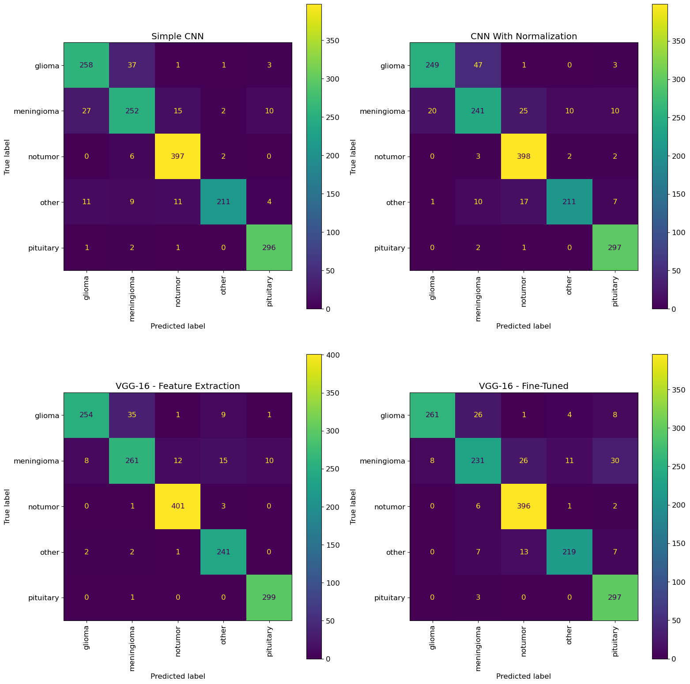

# Brain Tumor Classifier Using Convolutional Neural Network (CNN)
## Summary
I was tasked with creating a model to predict what type of brain tumor a patient has (if any) among five classes given an image of an MRI. This model can be offered by the American College of Radiology to facilities it accredits to aid in diagnosing brain tumors.

I used two datasets:
- 7,023 total T1C-enhanced MRI images of pituitary, meningioma, and glioma, as well as images of brains with no tumors.  These images are from a [dataset available on Kaggle from Masoud Nickparvar.](https://www.kaggle.com/datasets/masoudnickparvar/brain-tumor-mri-dataset)
- A subset of 1,177 "other" tumor MRI images from a [dataset available on Kaggle from Fernando Feltrin.](https://www.kaggle.com/datasets/fernando2rad/brain-tumor-mri-images-44c) In constructing this "other" class, I used only T1C-enhanced MRI images from tumor types not included in the first dataset.

From this data, I constructed an overall dataset with five classes (pituitary, meningioma, glioma, no tumor, other tumor). When building my models, I prioritized maximizing accuracy - the overall proportion of correct predictions by the model. In refining this model in the future I would likely prioritize recall most highly since a false negative is a potentially fatal error, but given the limited scope of the training data accuracy felt appropriate for now.

My preprocessing included splitting the data into train and test sets, and using image augmentation to increase the size of the training data. I tested a variety of different CNN architectures, eventually settling on a relatively simple model with two convolutional and max pooling layers, two dense layers, and a classification layer. The model achieved roughly a 90.9% accuracy score on test data.

## Business Understanding
According to the [National Brain Tumor Society](https://braintumor.org/brain-tumors/about-brain-tumors/brain-tumor-facts/), an estimated 700,000 people in the United States are living with a primary brain tumor. Over 94,000 people will receive a brain tumor diagnosis in 2023, and over 18,000 people will die as a result of brain tumors. Even so-called "benign" tumors can have massively deleterious impacts on a patient's quality of life - and malignant tumors such as gliomas can often be fatal.

Accurate classification of tumor type is a key step in the treatment process. Yet according to the [National Cancer Institute, as of 2020 5-10% of people with a brain tumor receive an incorrect diagnosis.](https://www.cancer.gov/rare-brain-spine-tumor/blog/2020/brain-tumors-diagnosed-treated) This may be in part because there are hundreds of different types of brain tumors, as [classified by the World Health Organization.](https://www.ncbi.nlm.nih.gov/pmc/articles/PMC8328013/) A deep learning model that is properly trained on MRI images from patients with a wide variety of brain tumors could be a valuable tool available to clinicians conducting MRIs on patients seeking care for brain tumor symptoms.

Existing deep learning models tend to focus on only 3 classes of tumors (pituitary, meningioma, and glioma) due to the limited availability of MRI images. Some models also include a "healthy" or "no tumor" category. While some publicly-available data exists for other tumor types, the sample sizes are too small for true deep learning. This project seeks to build on existing literature by adding one additional class to these - an "other tumor" class that includes images from MRIs taken of patients with rarer tumor types.

An accurate tumor classification model that is trained on a broader array of data than existing models has the potential to be enormously useful to a stakeholder such as facilities accredited by the American College of Radiology, who will see patients with a wide variety of different tumor types.

## Data Understanding

I used two datasets:
- 7,023 total T1C-enhanced MRI images of pituitary, meningioma, and glioma, as well as images of brains with no tumors.  These images are from a [dataset available on Kaggle from Masoud Nickparvar.](https://www.kaggle.com/datasets/masoudnickparvar/brain-tumor-mri-dataset)
- A subset of 1,177 "other" tumor MRI images from a [dataset available on Kaggle from Fernando Feltrin.](https://www.kaggle.com/datasets/fernando2rad/brain-tumor-mri-images-44c) In constructing this "other" class, I used only T1C-enhanced MRI images from tumor types not included in the first dataset.

The use of this second dataset is what allowed me to construct the "other" category, which differentiates this model from many other proposed approaches.

## EDA, Cleaning, Modeling, and Evaluation
EDA revealed that there was no significant class imbalance in the data, and that some types of tumors are easy to identify visually (such as pituitary tumors), while others can be harder to distinguish.


After this initial EDA, I constructed a baseline model with a single dense layer as a baseline. This model achieved a roughly 76% accuracy on test data. I followed that by testing four different convolutional approaches:
1. A simple CNN model with two convolutional layers, two dense layers, and no regularization.
2. A slightly deeper CNN model with two convolutional layers (one of which used batch normalization), three dense layers, and one dropout layer.
3. A VGG-16 model with all convolutional layers frozen for use in feature extraction, with two dense layers and two dropout layers.
4. A fine-tuned VGG-16 model with the final convolutional layer unfrozen, with two dense layers and two dropout layers.

When building my models, I prioritized maximizing accuracy - the overall proportion of correct predictions by the model. Models 1, 2, and 4 performed comparably in terms of accuracy, so I dug in deeper to the results of each model to determine which to select as my final model.



Of the tumor classes included, gliomas are the most serious diagnosis. The most common gliomas in adults are glioblastomas, which have a five-year survival rate of only 6.8 percent and an average length of survival after diagnosis of only 8 months. However, [early interventions could potentially improve the outcomes of glioblastoma patients](https://link.springer.com/article/10.1007/s11912-021-01157-0), and [MRIs can be a tool to help detect glioblastomas in their early stages.](https://www.ncbi.nlm.nih.gov/pmc/articles/PMC6516039/) We want our model to correctly detect these cases as often as possible so the patient can follow up and start treatment appropriately. 

The CNN with regularization has the highest recall for gliomas at 94%, which means it correctly detected 94% of all the gliomas in the dataset - the highest rate of the three models by far. **Subsequently, I selected the CNN with regularization (model 2) as my final model because it performs comparably to the other two on accuracy and overall recall while scoring the highest on recall for the most serious classification.**

## Streamlit App
I built a simple Streamlit app that allows a user to upload an image of an MRI and generate a prediction about the tumor type based on the selected model. 

## Conclusions and Next Steps
This project built on existing work in the brain tumor detection space by expanding the number of classes in the dataset. The selected model achieved an overall accuracy, precision, and recall of roughly 90%, while achieving a recall of 94% for the most serious diagnosis in the dataset. In order to be more broadly applicable, the model would need to be trained on a wider variety of tumor images, as well as images of other potential diagnoses detectable by MRI such as blood clots, aneurysms, dementia, and others.

Some next steps I would like to take are:

1. Preprocess the images further by thresholding and cropping the skull/brain, to reduce the amount of black space and other potential noise present in each image before modeling.
2. Expand the number of classes further to make more granular classificaiton predictions possible.
3. Test additional transfer learning approaches, such as the one [proposed in this paper.](https://www.ncbi.nlm.nih.gov/pmc/articles/PMC9600529/)

## Links to Materials
Presentation
[Jupyter Notebook](https://github.com/emgerber88/brain_tumor_CNN_classifier/blob/main/Brain_Tumor_CNN_Modeling.ipynb)

## Repository Structure
```
├── images
├── data
├── .gitignore
├── Brain_Tumor_CNN_Modeling.ipynb
└── README.md
```